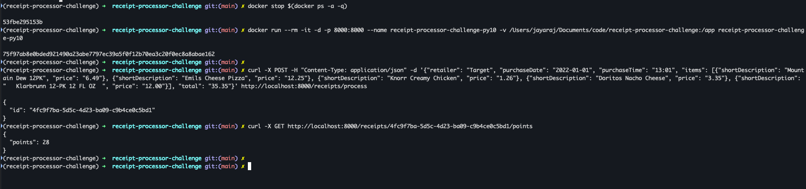

# Run these commands to get the webservice running on port 8000 (MAC-OS)



### todo: use docker compose
```bash
docker build -f Dockerfile-App -t receipt-processor-challenge-py10 .

docker run --rm -it -d -p 8000:8000 --name receipt-processor-challenge-py10 -v ${PWD}:/app receipt-processor-challenge-py10

or

docker run --rm -it -d -p 8000:8000 --name receipt-processor-challenge-py10 receipt-processor-challenge-py10

docker stop $(docker ps -a -q)

```


# Run the below commands to verify the output of the webservice

```bash
curl -X POST -H "Content-Type: application/json" -d '{"retailer": "Sample Retailer", "purchaseDate": "2020-01-01", "purchaseTime": "12:00", "total": "100.00", "items": [{"shortDescription": "Item 1", "price": "50.00"}, {"shortDescription": "Item 2", "price": "50.00"}]}' http://localhost:8000/receipts/process


# todo: instructions to run tests without exec
docker exec -it receipt-processor-challenge-py10 bash
# from within container
root@53fbe295153b:/app# pytest tests.py

```
